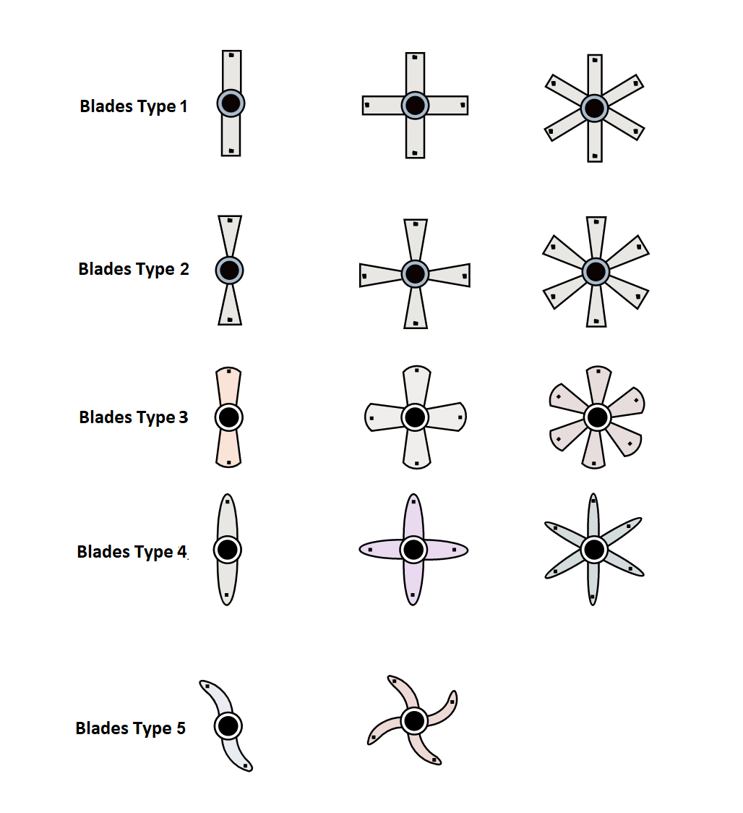

# Procedure
### Basic Knowledge - 
- Answer all the questions and click on "Submit Test" button.

### Configuration:-
- Configure your turbine flow meter by selecting fluid type, material type of blade, blade type , pipe size , time in sec and enter the meter constant. Below fig. shows the type of blade and number of blades. 

-  Min and Max speed range will be displayed. Here, readings can be taken by changing speed of VFD that you have configured.
- Observe the reading .
- Plot the graph
- After this click on next simulation step.

### Simulation:-

#### Standard Table and Graph:
- Select any Random range and click on submit.
- Take atleast 5 Readings and click on Graph.
 
#### Animation :
- Click on Start process. 
- Instantaneous flow observed by total pulses

#### Mimic : 
- First step is to reset the tare weight 
- Adjust the VFD speed clicking on plus and minus buttons. Select minimum and maximum speed of flow.
- click on the suction valve(V1), after clicking its color turns to green which indicated it is ON and liquid supply to pump.
- To start the pump, click on the pump it turns green and liquid flow through pump with selected speed for sec of time which is configured in earlier stage.
- Observe the reading of LT weight, Turbine flow meter, Magnetic flow meter and WT weight.
- After the process, pump will stop, then you must click on V2 valve it will turn green to drain the tank 2 and fill the tank 1.
- Follow the same process for at least for 10 times and note all readings including speed range in min and max flow.
- After completing all process, click on V3 drain valve to drain the tank 1. 
- The simulation is finished, and you can click on next for Calibration.

#### Calibration :
- Observe the Minimum reading and calculate zero error and submit the answer. 
- Observe Maximum reading and calculate span error and submit the answer.
- Similarly Observe all the intermediate points on the graph and calculate Lineraity and Accuracy.
- Click on Calibrate and calibrate points on graph (using plus and minus buttons). 
- Follow the Instructions and adjust the points on the graph to make it linear.

#### Fault Finding:
- Observe the shown table and select the fault accordingly.
- After selecting the correct fault Result will be displayed.

