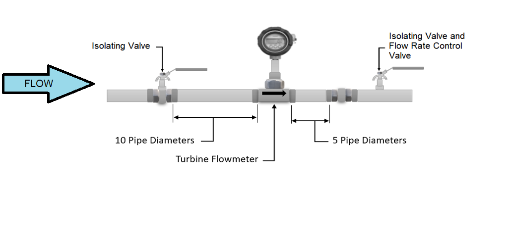
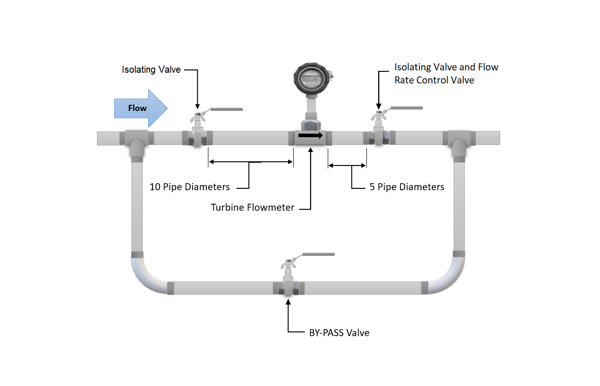
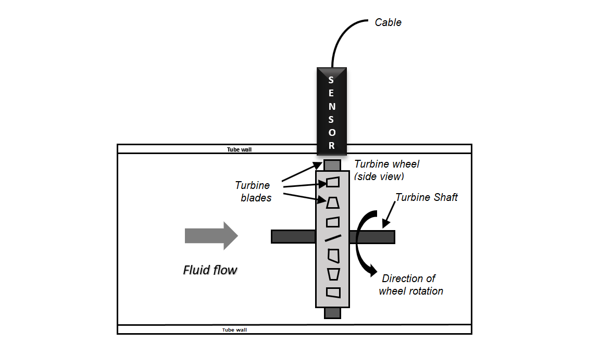
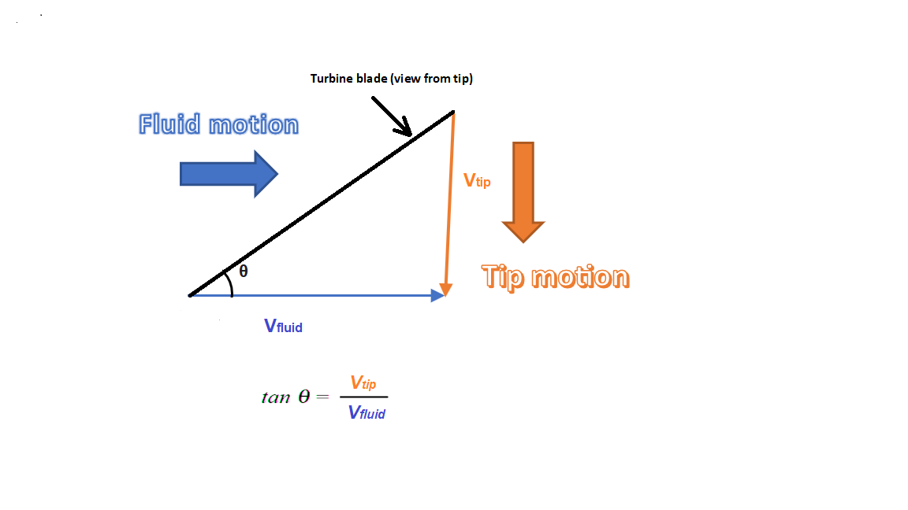

# Introduction
Turbine type flow meters are similar to a propeller held against the wind when we keep the propeller against wind it rotates, and if you observe carefully there exists a relation between velocity of wind and rotational speed of turbine, the rate of rotation increases as the wind velocity increases. These observations suggest that the flow velocity in a pipe can be measured by placing a freely rotating propeller inside a pipe section, but it needs calibration. These type of flow meters are more commonly known as "Turbine Type Flow meters". A cut section of the turbine type flow meter is as shown in figure 1 and 2. The construction is similar to a mini wind mill.

Turbine flow meters are used in many industrial applications to measure the flow of liquid and gas. It consists of a multi-blade rotor mounted with a pipe perpendicular to the fluid flow. When the liquid passes through the blades, the rotor will spin. The speed of the rotor depends on the flow rate, the rotational movement can be measured either using gears or the opto-couplers. 
This flow meter would convert the mechanical action of the turbine as the fluid flow rate. This device would rotate according to the flow in which it is placed, the number of revolutions is proportional to the flow.
A turbine flow meter is used for volumetric total flow and/or instantaneous flow rate measurement and has a relatively simple working principle. As fluid flows through the turbine meter, it impinges upon turbine blades that are free to rotate about an axis along the centre line of the turbine housing.
Turbine flow meters use the mechanical energy of the liquid to rotate a rotor within the flow stream. The rotational speed is directly proportional to the velocity of the fluid traveling through the meter. These meters are generally recommended for multiple industries to reliably measure liquids, gases and vapours. Typically, these are found across various industries such as petroleum, automotive, laboratory and water treatment.
## Construction  
A major part of this device is a multi-blade rotor, and this rotor is mounted at an angle that the fluid flow can rotate the rotor. A ball bearing supports the rotor on a shaft which is retained in the flow meter housing by shaft support section. A magnetic pick up is mounted to the turbine wheel, and the sensor would record the voltage pulse that is created. The pulses so generated are counted to arrive at flow reading. While installing these flow meters care has to be taken that the foreign particles are not deposited on the blade or in the path. The rotor should be checked for free rotational movement. All upstream fluid lines should also be cleaned for any debris. 
The flow meter must be installed with the flow direction arrow pointing in the direction of fluid flow as marked by the manufacturer. These  flow meters can work in any orientation but generally they are installed in horizontal lines. A filter at the upstream  is recommended before the flow meter to trap the floating particles.  The picture shows the recommended scheme for installation of the flow meter in the pipe line. The bypass valve is provided to ensure “no disturbance” in case the turbine type flow meter is sent for maintainance.

The arrangement allows meter inspection and repair without interrupting flow,  as well as the ability to cycle the fluid through the system filter before diverting to the flow meter. If a bypass line is not used, it is important that all flow control valves be located downstream of the flow meter. A straight distance of 10 time pipe diameter and 5 times pipe diameter up-stream and down stream respectively is recommended as shown in the figure….

. This helps to eliminate turbulence in the fluid. Having shorter pipe lengths, other system components and elbows to close to the flow meter may adversely affect the accuracy and repeatability of the flow meter. Piping should be the same size as the meter bore or port size.
Do not locate the flow meter or the connection cable close to electric motors, transformers, sparking devices, high voltage lines or place connecting cable in a conduit with wire supplying power for such devices. These devices can induce false signals in the flow meter coil or cable, causingthe meter to read inaccurately.
The fundamental design goal of a turbine flow meter is to make the turbine element as free spinning as possible, so no torque will be required to sustain the turbine’s rotation. If this goal is achieved, the turbine blades will achieve a rotating (tip) velocity directly proportional to the linear velocity of the fluid, whether that fluid is a gas or a liquid.

The mathematical relationship between fluid velocity and turbine tip velocity – assuming frictionless conditions – is a ratio defined by the tangent of the turbine blade angle.

For a 45 deg blade angle, the relationship is 1:1, with tip velocity equalling fluid velocity. Smaller blade angles (each blade closer to parallel with the fluid velocity vector) result in the tip velocity being a fractional proportion of fluid velocity.
By using proximity sensor the turbine tip velocity can be  sensed. The proximity sensor will generate voltage which is equivalent to the velocity of the turbine blade. Generally, the proximity sensor is nothing more than a coil of wire in proximity to a stationary magnet, called a pickup coil or pick-off coil because it “picks” (senses) the passing of the turbine blades.
Magnetic flux through the coil’s centre increases and decreases as the passing of the steel turbine blades presents a varying reluctance (“resistance” to magnetic flux), causing voltage pulses equal in frequency to the number of blades passing by each second. It is the frequency of this signal that represents fluid velocity, and therefore volumetric flow rate.

## Working Principle
A turbine flow meter unit is constructed of a multiple-bladed rotor installed (as shown in the simulator) with a pipe in a perpendicular direction to the fluid flow. As the liquid flows through the blades, the rotor rotates. The rotational speed of the rotor is correlated to the flow rate of the liquid. The speed of the rotor can be sensed by various mechanisms such as magnetic pick-up, photoelectric cell, or gears. After proper installation, turbine meters offer good accuracy, mainly with low-viscosity liquids. Hence, turbine meters are widely deployed in applications where accurate measurements are required. When a turbine flowmeter is calibrated (As shown the calibration set-up) and operated for a single fluid, constant conditions, its turndown ratio can go beyond 100:1. Moreover, accuracy of a turbine flowmeter can be as good as +/-0.1%. The major problem associated with the usage of turbine meters is bearing wear.

 To prevent this problem, a “bearing less” turbine meter design has been introduced recently. Various turbine flowmeter designs have been manufactured. However, they all operate on the same basic principle which says “If a fluid moves through a pipe and acts on the vanes of a turbine, the turbine will start to spin and rotate. The rate of spin is measured to calculate the flow”.
 
 Below table shows standard range of flow rate according to pipe size in Litre Per Hour (l/h):
 
 | Pipe size | 15 | 25 | 40 | 50 | 
| ------- | -- | --| -- | -- | 
| Min | 200 | 800 | 1900 | 3500 | 
| Max | 2100 | 8000 | 19000 | 3500 | 
 
 ## General Specifications (Take it form Vatturkar’s website)
 ##### Services: 
 
   -	Relatively clean liquids, gases, and vapours (some units for gas service are also covered).
   
 ##### Sizes: 
  
   -  	3/16 to 24 in. (5 to 610 mm) in flow-through designs.

 ##### Outputs: 
  
   - 	Generally, linear frequency outputs are provided, but 4- to 20-mA DC can also be obtained through conversion.
  	
#####   Operating Pressure: 
  
   - 	1500 PSIG (10.3 MPa) in standard and 5000 PSIG (34.5 MPa) in special designs.

##### Pressure Drops: 

   -  	Usually, one velocity head or about 3 to 5 PSIG (20 to 35 kPa).
   
##### Operating Temperature:  
   
  - − 58 to 300 ° F (− 50 to 150 ° C) in standard and − 328 to 840 ° F (− 200 to 450 ° C) in extended pickup designs.
 	
#### Advantage of turbine flow meter
-	Good level of accuracy at an economic price 
-	Good level of accuracy at an economic price 
-	Simple, durable construction 
-	Easy to install and maintain.
-	Flexible connection to flow instruments for flow control.
-	Wide flow rangeability including low flow rates.
-	Wide variety of process connections
-	 Turndown ratio is up to 35:1.
-	Turbine meters can operate over a wide range of temperatures and pressures.
-	Low pressure drops across the turbine.
-	Provides a convenient signal output.
	
#### Disadvantage of turbine flow meter
 -	High cost
-	Problems caused by non-lubricating fluids. 
-	Limited use for slurry applications
-	Sensitive to flow profile 
-	It cannot be operated at high velocity.
-	Less accurate at low flow rates 
-	Moving parts
-	The bearing is depended on the cleanliness and lubricity of the process fluid. 
-	Interchangeability from unit to unit is very poor.
-	Wear and tear could happen to the turbine blades, and it needs to be calibrated frequently.
-	For certain liquid applications, there could be problems such as cavitation, specific gravity, and viscosity.
	
#### Turbine flow Meter Limitations
-	Turbine meters can be used with clean liquids and gases only (may need to install a strainer upstream to prevent damage from particulates) 
-	Requires constant backpressure to prevent cavitation. 
-	Accuracy adversely affected by bubbles in liquids.
-	Not applicable for measuring corrosive fluids.
-	Sensitive to changes in fluid viscosity 
-	Requires a turbulent flow profile (consistent fluid velocity across the pipe diameter) for accuracy
-	Require a straight run of pipe before and after the turbine meter to allow swirl patterns in the flow stream to dissipate
-	May not function properly with high viscosity fluids where the flow profile is laminar.
	
#### Turbine Flow Meter Application
 -	It is used in the blending system of the petroleum industry
-	Airborne applications for energy fuel and cryogenic flow measurement
-	Chemical industries
-	Food and beverage
-	Oil and gas
-	Refining
-	Semiconductor
-	Agricultural
-	Pharmaceutical
-	Photo development
-	Process control
-	Food beverage dispensing
-	The turbine meters are widely used for military applications.
-	They are particularly useful in blending systems for the petroleum industry.
-	They are effective in aerospace and air borne applications for energy-fuel and cryogenic flow measurements.

